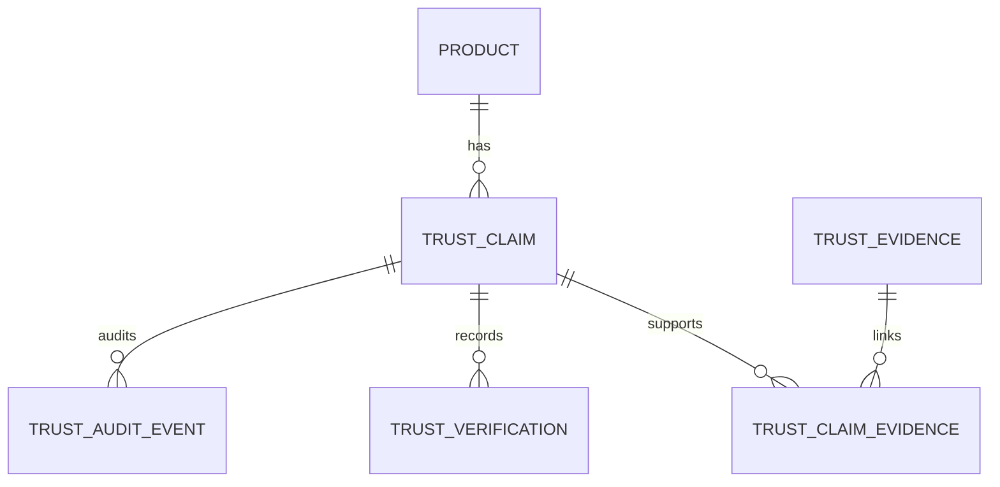

# Trust Data Foundation

Phase 1 adds an internal, product-scoped Trust data foundation. It does not expose customer Trust UI, calculate scores, or create supplier scoring.

## Relationships

- `TrustClaim` is a flexible product assertion: type, value, description, source, current verification status, optional confidence, and assessment metadata.
- `TrustEvidence` is reusable supporting material. It stores references only, not binary files. One or both of `reference_url` and `storage_reference` are required.
- `TrustClaimEvidence` is the many-to-many link and provides future per-claim evidence assessment metadata.
- `TrustVerification` is append-only history. Each record snapshots the selected linked evidence, so later evidence deactivation or update does not erase the historical decision context.
- `TrustAuditEvent` is append-only operational history containing actor, event, prior/current state, reason, and metadata. PostgreSQL triggers reject updates or deletes to verification and audit rows during normal application operation.

## Verification Lifecycle

Current claim states are `UNVERIFIED`, `PENDING`, `VERIFIED`, `REJECTED`, and `EXPIRED`.

Creating a verification appends a new `TrustVerification` and updates the claim's current state; prior records are never changed or removed. A `VERIFIED` decision requires one or more active evidence items already attached to the claim. Verified claim content cannot be edited through the service; a new verification workflow is required. A verified claim whose most recent verification has passed its expiry becomes `EXPIRED` when read through the Trust service, with an audit event recorded.

Initial verification methods are `SUPPLIER_DOCUMENT`, `MANUFACTURER_DOCUMENT`, `CERTIFICATION`, `TEST_REPORT`, `INTERNAL_REVIEW`, `CUSTOMER_FEEDBACK`, `SYSTEM_REVIEW`, and `OTHER`. They are centralized in `app.core.trust` for consistent validation and can be extended deliberately.

## API and Authorization

All Phase 1 endpoints are internal admin APIs under `/api/v1/admin/trust`. They use `get_current_admin`; customers and anonymous callers cannot create or change claims, evidence, verifications, or audit history.

The `TrustService` owns validation, history creation, current-state updates, expiry handling, and audit writes. `TrustRepository` owns aggregate loading. No customer-facing Trust endpoint exists in this phase.
